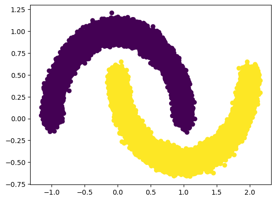
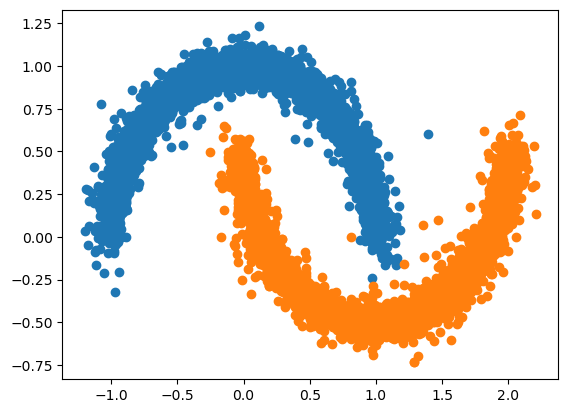
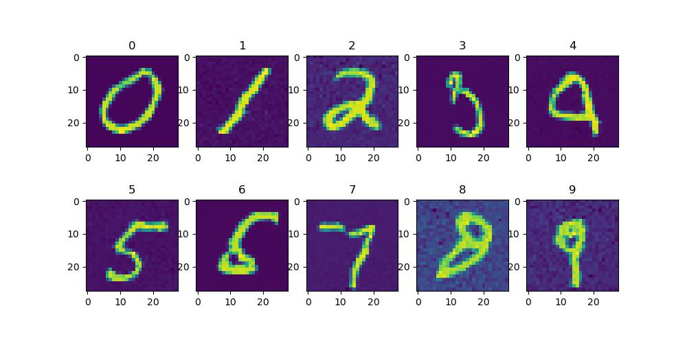

Since I saw no simple and intuitive implemenation for OT Flow-Matching, I decided to share my own implementation.

code.ipynb file is the implementation for a 2-D Moons dataset. I implemented the model to generate the entire distribution and to generate conditioned on the class.

Here is the original Distribution:

And Here is the generation results:

mnist.ipynb is my implementation for the MNIST dataset. I know other literature use a transformer architecture for the generator but due to GPU limitations, I could only work with UNet. I used a linear projection layer to transform class condition and t to the image dimensions just before the bottleneck layer and then fed X, and the projection to the bottleneck and the decoder.

Here are some generated samples:

